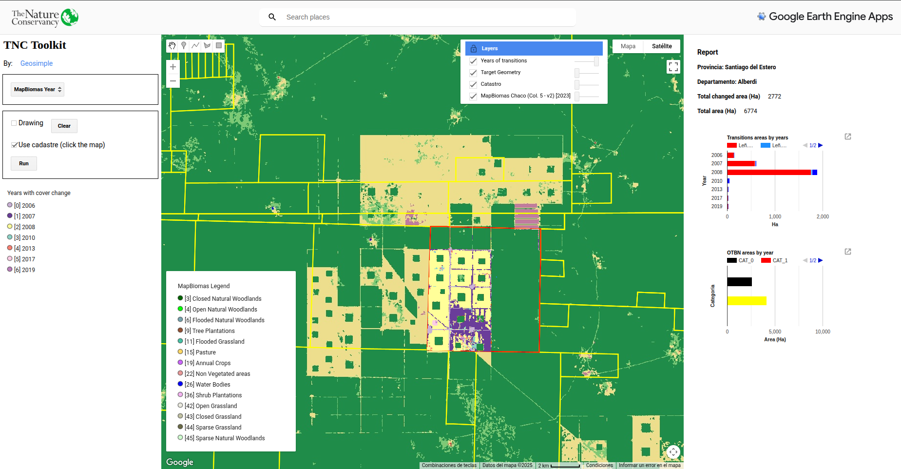
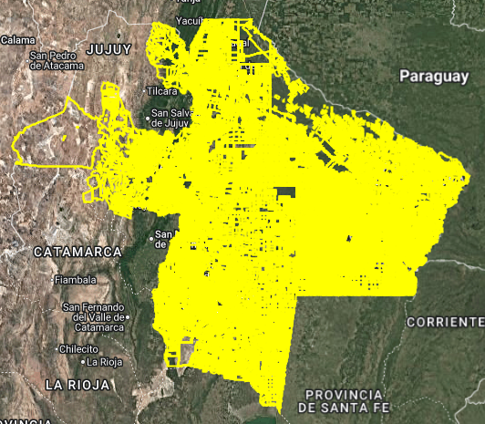
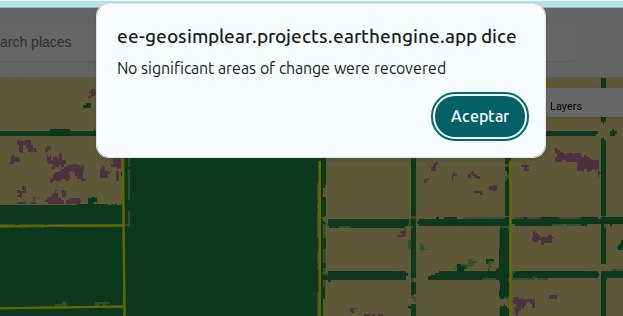

# App tnc-toolkit

TNC-Toolkit is a tool for querying MapBiomas collections that, based on a polygon geometry, allows recovering information on transitions over time from a series of land use and land cover maps. These transition layers are added to the map and are shown as years in which these changes occur from natural vegetation (mainly Forest) to anthropic class (agriculture or pasture).

## Google Earth Engine App

    https://ee-geosimplear.projects.earthengine.app/view/tnc-toolkit-mapbiomas-chaco

## App Interface

 1. Target geometry options.
 2. Run analysis button.
 3. Changed years legend
 4. LULC MapBiomas Legend
 5. Report area
 6. Area transitions plot
 7. Areas corresponding to the forest law regulations (OTBN)
 8. Layers included in the map
 9. Target geometry visualization

## Target geometry options

There are two options for entering a target geometry for analysis. The first is by drawing it on the map and the second is by selecting it from an cadastre asset available for some provinces of Argentina.
	

To use the cadastral information as a target, click **"Use Cadastre"** and then click the cadastral unit you want to query on the map. Then click Run.

**IMPORTANT**: Since calculations are performed at runtime, if the geometry is very large, this may result in a timeout. In this case, try running again or switch to drawing mode and reduce the area.

## Years of change legend

Legend showing the years that show changes from forest to agriculture or pasture classes.

### LULC MapBiomas Legend

MapBiomas legend of the current collection

## Report area

Report area, all the information recovered from the AOI is shown in the report. It includes information on the location (province and department), AOI area and area of change in hectares and two analysis graphs. One on the area of change per year and another on the area in relation to the OTBN regulations.

## Area transitions plot

This graph shows the areas of transitions by year. 

The [legend codes](https://chaco.mapbiomas.org/legend-codes/) can be verified from the [MapBiomas Chaco](https://chaco.mapbiomas.org) website or from other initiatives that wish to be used. They are also provided in the LULC legend.

## Areas corresponding to the forest law regulations (OTBN)

These areas correspond to the total sum of changes in each of the categories of the territorial planning of native forests for all years.

## Warning message

If the target geometry does not contain significant areas of change, a warning message will appear.

 
