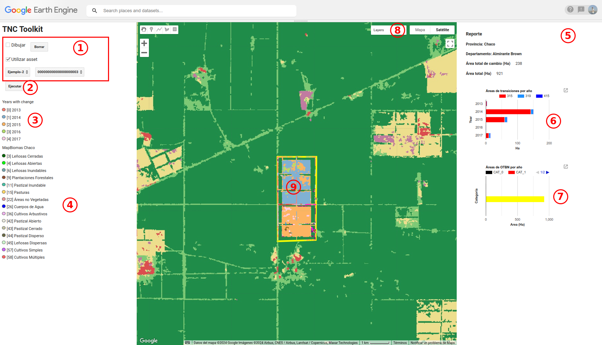

# tnc-toolkit

TNC-Toolkit is a TNC-Toolkit is a tool for querying MapBiomas collections that, based on a polygon geometry, allows recovering information on transitions over time from a series of land use and land cover maps. 

## Google Earth Engine Repository

    https://code.earthengine.google.com/?accept_repo=users/geosimplear/tnc-toolkit

To run the toolkit open the app.js script from [Code Editor](https://code.earthengine.google.com/) and run it from Run.

## Interface



 1. Target geometry options.
 2. Run analysis button.
 3. Changed years legend
 4. LULC MapBiomas Legend
 5. Report area
 6. Area transitions plot
 7. Areas corresponding to the forest law regulations (OTBN)
 8. Layers included in the map
 9. Target geometry visualization

## Target geometry options

There are two options for entering a target geometry for analysis. The first is by drawing it on the map and the second is by selecting it from an asset available in GEE to which we have access.

The second option can be set in the app.js configuration in section 2 assets settings. The AOI section allows you to define different layers to use as analysis geometries.

```javascripts
// 2) Assets Settings
var assets = {
    
    // AOI Generales definidas ad-hoc
    aoi: [
        {
            label: "Ejemplo", 
            path: "users/geosimplear/tnc/parcelas-ejemplo", 
            field: "system:index"
        },
        
    ],
    
    // MapBiomas Collections Settings
    datasets: {
        cover: {
            label: "MapBiomas Chaco (v4.1)",
            path: "projects/mapbiomas-chaco/public/collection4/mapbiomas_chaco_collection4_1_integration_v1",
            style: {min:0, max: 65, bands: ["classification_2022"] ,palette: palettes.get('atlantic_forest')}
        },
        otbn:{
            label: "OTBN",
            path: "projects/geosimple-ipcva/assets/OTBN-250m-mask1",
            style: {}
        },
        provincia:{
          label: "Provincias",
          path: "users/geosimplear/tnc/provincia",
          style: {},
          field: "nam"
        },
        departamento:{
            label: "Provincias",
            path: "users/geosimplear/tnc/departamento",
            style: {},
            field: "nam"
          }
  
        
    }
}
```


## 

